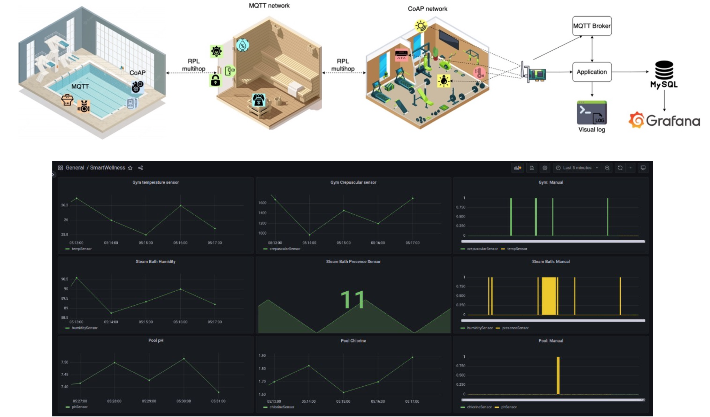

# SmartWellness
SmartWellness is an IoT telemetry and control system. SmartWellnes is divided in 3 smart area (to support wellness activities): swim, steam bath and gym. 
SmartWellness is capable of:
- automatic remote-control of actuators, based on values collected by sensors
- detect when the actuators are being used in manual mode, and behaving accordingly
- collect (with a collector) all the data sensed, store them in a MySQL database
- allow user to visualize data and stats of each sensor through a web interface developed using Grafana.
Half of the devices in the network use the CoAP protocol to expose their resources, while the other half use the MQTT protocol.
LEDs of devices display the status of the actuator (e.g., ON or OFF).
(Smart wellness is deployed using real nodes, six Launchpad CC2650, and each of them (except the border router) implement both sensor and the respective actuator)

[Here1](requirements.pdf) are present the requirements of the project and the complete documentation is available [here2](documentation.pdf)

(Repository for internet of things' project)

## Main goals are:
- to develop network of IoT devices, including sensors collecting data from the physical system/environment and actuators. Those IoT devices have to use MQTT and CoAP;
- to develop a collector application that collects data from sensors, and sends commands to the actuators;
- to use Grafana in order to display collected data to the user.

## Project structure
 - `CoAP-network`: contains all the CoAP devices
 - `CoapNetworkLaunchpad`:  Launchpad CC2650 implementation of `CoAP-network`
 - `MQTT-network`: contains all the MQTT devices
 - `MQTTNetworkLaunchpad`:  Launchpad CC2650 implementation of `MQTT-network`
 - `SmartWellnessCollector`: the Java(8) collector application module
 - `cooja`: a cooja (Contiki-NG) simulation of the network
 - `database`: the MySQL database schema
 - `rpl-border-router`: the Contiki-NG border router module

## Preview

   

